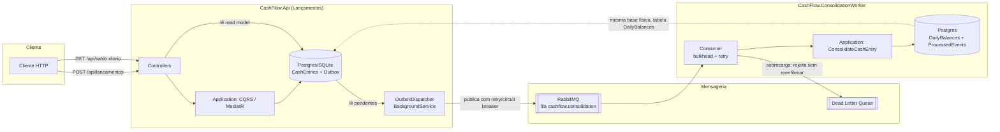

# CashFlow — Gestão de Fluxo de Caixa

Solução para o desafio técnico de Desenvolvedor de Software: um sistema para um lojista registrar
lançamentos financeiros (créditos e débitos) e consultar o saldo diário consolidado.

> Arquitetura, padrões de projeto e as decisões técnicas por trás de cada escolha estão detalhados
> em [`docs/architecture.md`](docs/architecture.md) — vale a leitura antes de mexer no código.

## Sumário

- [Visão geral](#visão-geral)
- [Desenho da solução](#desenho-da-solução)
- [Stack técnica](#stack-técnica)
- [Pré-requisitos](#pré-requisitos)
- [Como rodar](#como-rodar)
- [Como testar](#como-testar)
- [Endpoints](#endpoints)
- [Estrutura do projeto](#estrutura-do-projeto)
- [Decisões técnicas — resumo](#decisões-técnicas--resumo)
- [Melhorias futuras](#melhorias-futuras)

## Visão geral

A solução é dividida em dois serviços desacoplados por mensageria, para que o registro de
lançamentos nunca dependa da disponibilidade da consolidação de saldo (requisito não-funcional
explícito do desafio):

- **`CashFlow.Api`** — recebe lançamentos (`POST /api/lancamentos`) e expõe o saldo diário já
  consolidado (`GET /api/saldo-diario/{data}`). Sempre disponível, mesmo se a consolidação estiver
  fora do ar.
- **`CashFlow.ConsolidationWorker`** — consome os eventos de lançamento de forma assíncrona e
  mantém a tabela de saldo diário atualizada. Pode cair e voltar sem perder dados (fila durável +
  Outbox no produtor).

Os dois compartilham `CashFlow.Domain` e `CashFlow.Application` (Clean Architecture), mas rodam
como processos independentes.

## Desenho da solução



Dois serviços desacoplados por um Outbox + fila durável: a Api de lançamentos nunca depende da
disponibilidade da consolidação para responder. O diagrama de sequência do fluxo completo (do
`POST` até o saldo aparecer) e o diagrama do cenário de resiliência (worker caindo e voltando, já
testado de verdade em containers) estão em
[`docs/architecture.md`](docs/architecture.md#fluxo-de-um-lançamento-passo-a-passo) — junto com o
raciocínio por trás de cada decisão técnica.

## Stack técnica

- **.NET 10 / C# 13**, ASP.NET Core Web API + Worker Service
- **MediatR** (CQRS) + **FluentValidation**
- **Entity Framework Core 10** — SQLite (local, sem Docker) ou PostgreSQL (via `docker-compose`)
- **RabbitMQ.Client 7** — mensageria assíncrona entre os dois serviços (modo produção)
- **Polly** — retry + circuit breaker + bulkhead
- **Serilog** — logs estruturados
- **xUnit + FluentAssertions + Moq** — testes unitários e de integração (`WebApplicationFactory`)
- **Docker / docker-compose** — Api + Worker + Postgres + RabbitMQ

## Pré-requisitos

- Para rodar localmente sem Docker: [.NET 10 SDK](https://dotnet.microsoft.com/download/dotnet/10.0)
- Para rodar a topologia completa (recomendado para avaliar a resiliência de verdade): **Docker**
  e **Docker Compose**

## Como rodar

### Opção A — `dotnet run`, sem Docker (mais rápido para avaliar)

Não precisa de Postgres nem RabbitMQ: usa SQLite e uma fila em memória, e a própria Api também
hospeda o consumidor de consolidação (ver [`docs/architecture.md`](docs/architecture.md), seção
"Duas topologias de execução", para o que isso implica em termos de garantia de resiliência).

```bash
cd src/CashFlow.Api
dotnet run
```

A Api sobe em `http://localhost:5274` (ou a porta impressa no console) e cria o arquivo
`cashflow.db` automaticamente na primeira execução. Use o arquivo
[`CashFlow.Api.http`](src/CashFlow.Api/CashFlow.Api.http) (VS Code/Rider/Visual Studio) ou os
exemplos de `curl` abaixo. O Swagger fica disponível em `/swagger` em ambiente de desenvolvimento.

### Opção B — `docker compose`, topologia de produção (Api + Worker + Postgres + RabbitMQ)

Esta é a forma que efetivamente isola os dois serviços em processos/containers separados —
recomendada para verificar o requisito de resiliência na prática (derrube o container do worker e
veja os lançamentos continuarem funcionando normalmente).

```bash
docker compose up --build
```

- Api: `http://localhost:8080`
- Painel do RabbitMQ: `http://localhost:15672` (usuário/senha: `guest`/`guest`)
- Postgres: `localhost:5432` (usuário/senha/banco: `cashflow`/`cashflow`/`cashflow`)

Para simular a falha do serviço de consolidação sem afetar os lançamentos:

```bash
docker compose stop consolidation-worker
# os lançamentos continuam sendo aceitos normalmente:
curl -X POST http://localhost:8080/api/lancamentos -H "Content-Type: application/json" \
  -d '{"description":"Venda","amount":50,"type":1}'
# ao subir o worker de novo, o backlog acumulado na fila é processado automaticamente:
docker compose start consolidation-worker
```

## Como testar

```bash
dotnet test
```

Roda os três projetos de teste:

- `CashFlow.Domain.Tests` — regras de negócio puras (`CashEntry`, `DailyBalance`).
- `CashFlow.Application.Tests` — handlers de commands/queries (incluindo o teste de idempotência
  da consolidação) contra um `DbContext` EF Core InMemory.
- `CashFlow.Api.Tests` — testes de integração ponta a ponta (`WebApplicationFactory`): registra um
  lançamento via HTTP e valida que o saldo diário reflete o valor após a consolidação assíncrona.

## Endpoints

| Método | Rota | Descrição |
|---|---|---|
| `POST` | `/api/lancamentos` | Registra um lançamento (crédito ou débito) |
| `GET` | `/api/lancamentos?from=&to=&type=&page=&pageSize=` | Lista lançamentos, com filtros e paginação |
| `GET` | `/api/saldo-diario/{data}` | Saldo consolidado de um dia (`404` se ainda não processado) |
| `GET` | `/api/saldo-diario?from=&to=` | Saldo consolidado por período |
| `GET` | `/health` | Healthcheck (inclui verificação do banco) |

Exemplo de payload de `POST /api/lancamentos`:

```json
{
  "description": "Venda no cartão",
  "amount": 150.75,
  "type": 1,
  "occurredOn": "2026-09-01"
}
```

`type`: `1` = Crédito, `2` = Débito. `occurredOn` é opcional (assume a data atual quando omitido)
e não pode ser uma data futura.

## Estrutura do projeto

```
desafio-fluxo-caixa/
├── docs/architecture.md          # arquitetura, diagrama e decisões técnicas
├── docker-compose.yml
├── src/
│   ├── CashFlow.Domain/          # entidades, regras de negócio, eventos — zero dependências externas
│   ├── CashFlow.Application/     # CQRS (MediatR), validação, contratos (portas)
│   ├── CashFlow.Infrastructure/  # EF Core, Outbox, RabbitMQ/InMemory, Polly
│   ├── CashFlow.Api/             # Controllers, Swagger, middleware de erro
│   └── CashFlow.ConsolidationWorker/  # BackgroundService consumidor
└── tests/
    ├── CashFlow.Domain.Tests/
    ├── CashFlow.Application.Tests/
    └── CashFlow.Api.Tests/
```

## Decisões técnicas — resumo

Cobertas em detalhe em [`docs/architecture.md`](docs/architecture.md):

- **Transactional Outbox** garante que um lançamento nunca é salvo sem seu evento de integração
  correspondente ficar agendado para publicação — mesmo com o RabbitMQ fora do ar.
- **Inbox (deduplicação por `EventId`)** no worker torna a consolidação idempotente diante de
  reentregas da fila.
- **Bulkhead + Dead Letter Queue** no consumer atendem ao requisito de suportar picos de 50 req/s
  tolerando até 5% de perda **sem descartar dado de verdade** — mensagens em excesso vão para uma
  DLQ para reprocessamento em lote, em vez de serem perdidas ou travarem o consumo.
- **CQRS + Clean Architecture** mantêm a regra de negócio isolada de EF Core/RabbitMQ/ASP.NET —
  testável sem subir nenhuma infraestrutura externa.

## Melhorias futuras

Itens que ficaram de fora por escopo/tempo, mas que fazem parte do caminho natural de evolução:

- **EF Core Migrations** versionadas por provider, substituindo o `EnsureCreatedAsync` atual
  (adotado para simplificar a avaliação local com dois providers).
- **Banco de dados próprio por serviço** (hoje Api e Worker compartilham a mesma instância
  Postgres, em tabelas separadas) para isolamento também no nível de infraestrutura.
- **Autenticação/autorização** (JWT) nos endpoints — fora do escopo do desafio, mas o
  `ExceptionHandlingMiddleware` e a estrutura de camadas já comportam a adição sem retrabalho.
- **Escalar o `ConsolidationWorker` horizontalmente** (múltiplas réplicas concorrendo na mesma
  fila) para aumentar throughput real em vez de só controlar sobrecarga via bulkhead/DLQ.
- **Observabilidade**: OpenTelemetry (traces distribuídos entre Api → RabbitMQ → Worker) e
  métricas de profundidade de fila/DLQ para alertar sobre consolidação atrasada.
- **Dashboard/relatório visual** do saldo diário — o desafio pede o dado consolidado; uma UI
  consumindo `GET /api/saldo-diario` seria o próximo passo óbvio para o usuário final (o lojista).
