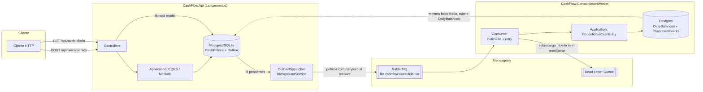
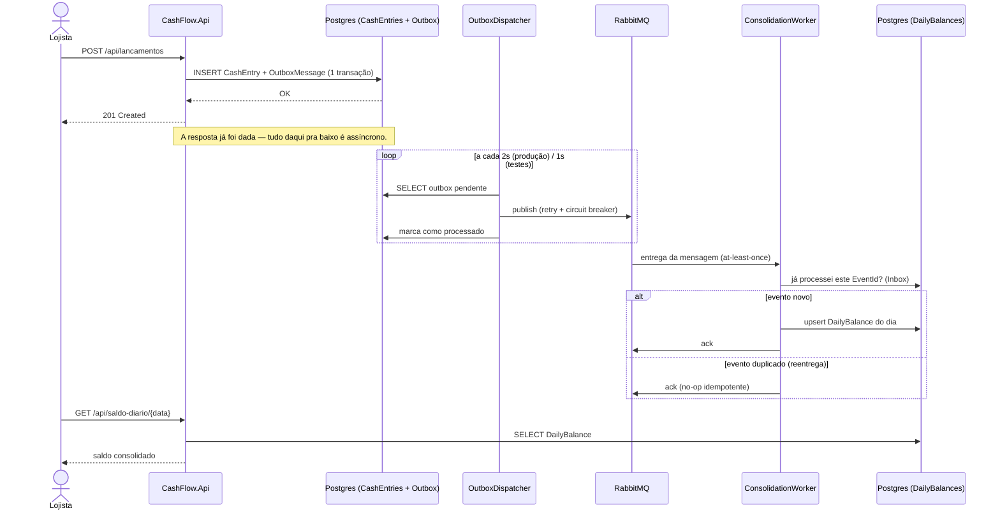
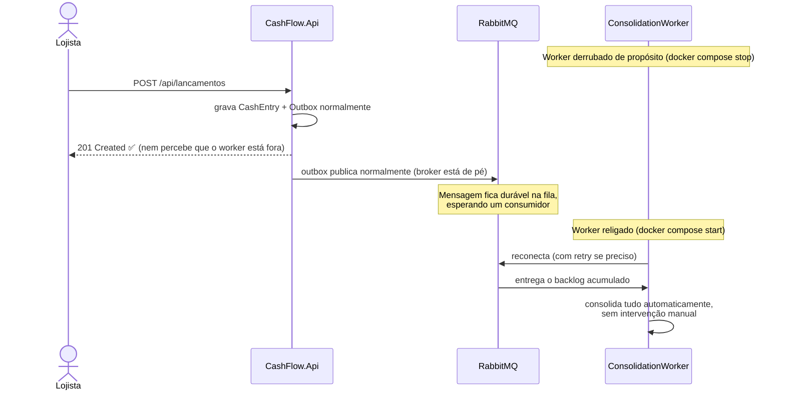

# Arquitetura

## Visão geral

O desafio pede duas capacidades de negócio: **registrar lançamentos** (créditos/débitos) e
**consultar o saldo diário consolidado**. O requisito não-funcional mais importante é que a
primeira nunca pare por causa da segunda, e que a segunda aguente picos de 50 req/s tolerando até
5% de perda. Isso é, na prática, um pedido para separar um *serviço de escrita* (forte
consistência, sempre disponível) de um *serviço de leitura agregada* (pode atrasar, nunca pode
travar o primeiro) — então o desenho gira em torno de dois serviços desacoplados por mensageria,
com Clean Architecture dentro de cada um.



## Fluxo de um lançamento, passo a passo



## Cenário de resiliência: consolidação fora do ar

Testado de verdade em containers (`docker compose stop/start consolidation-worker`), não só
projetado — ver detalhes na seção "Validado em containers reais" mais abaixo.



## Duas topologias de execução

O código suporta duas formas de rodar, trocadas só por configuração (`Messaging:Provider`,
`Database:Provider`) — ver [README.md](../README.md):

| | **Single-process (padrão, `dotnet run`)** | **Produção (`docker-compose`)** |
|---|---|---|
| Banco | SQLite (arquivo local) | Postgres |
| Mensageria | `Channel<T>` em memória | RabbitMQ (fila durável + DLQ) |
| Quem consolida | A própria `CashFlow.Api`, num `BackgroundService` interno | `CashFlow.ConsolidationWorker`, processo/container separado |
| Isolamento de falha | Parcial — é o mesmo processo | Total — o worker pode cair sem afetar a Api |

O modo single-process existe só para facilitar avaliar o desafio sem subir containers. **A
garantia real de "lançamentos sobrevive a uma falha na consolidação" só é 100% verdadeira na
topologia com RabbitMQ + dois processos** — é o que `docker compose up` sobe. Isso é uma escolha
deliberada de trade-off, documentada explicitamente em vez de fingir uma garantia que o modo
simplificado não oferece.

### Validado em containers reais (não só na teoria)

A topologia de produção (`docker compose up --build`) foi de fato executada e testada, não só
projetada no papel — inclusive o cenário central do requisito não-funcional:

```
docker compose stop consolidation-worker      # derruba a consolidação de propósito
curl -X POST .../api/lancamentos ...          # -> 201 Created (Api segue no ar normalmente)
docker compose start consolidation-worker     # religa
# o backlog acumulado na fila durável é consumido e consolidado automaticamente, sem replay manual
```

Esse teste também revelou (e corrigiu) dois problemas reais que só aparecem com múltiplos
processos concorrentes, documentados aqui porque o raciocínio é tão relevante quanto o fix:

1. **Corrida de `EnsureCreatedAsync` entre Api e Worker no mesmo banco.** Como os dois serviços
   sobem juntos e apontam para o mesmo Postgres, ambos tentavam criar o schema ao mesmo tempo.
   Pior: `EnsureCreatedAsync` decide se já existe schema checando apenas se **alguma** tabela
   existe (`HasTables()`), não se **todas as do modelo atual** existem — como o modelo da Api é
   um superconjunto do modelo do Worker, se o Worker vencesse a corrida e criasse suas 2 tabelas
   primeiro, a Api via "já existe tabela" e desistia de criar as suas (`CashEntries`/
   `OutboxMessages`), quebrando silenciosamente, sem lançar exceção. Corrigido fazendo o
   `ConsolidationDbContext` mapear o mesmo conjunto completo de tabelas do `AppDbContext`
   (`ConsolidationDbContext.cs`) — assim, não importa quem vença a corrida, o schema criado é
   sempre o completo — combinado com um `DatabaseInitializer` com retry para o caso mais simples
   de duas tentativas de `CREATE TABLE` simultâneas.
2. **Worker derrubava o processo inteiro se o RabbitMQ ainda não estivesse aceitando conexões.**
   O healthcheck do container do RabbitMQ passa um instante antes de o listener AMQP aceitar
   conexões de verdade; sem retry, essa janela derrubava o `BackgroundService` (e, por padrão,
   o host inteiro junto). Corrigido com um retry de backoff exponencial (sem limite de tentativas,
   até 30s entre elas) ao redor da conexão inicial em `RabbitMqConsolidationConsumer` — o próprio
   componente responsável por resiliência precisava ser resiliente à sua própria inicialização.

## Por que Transactional Outbox em vez de publicar direto no handler

Se o `RegisterCashEntryCommandHandler` publicasse no RabbitMQ diretamente após o `SaveChanges`,
uma falha do broker no meio da requisição teria duas saídas ruins: falhar a requisição inteira
(quebrando a promessa de "lançamentos sempre disponível") ou engolir a falha silenciosamente
(perdendo o evento para sempre). O Outbox Pattern grava o lançamento **e** o evento pendente na
mesma transação local — nunca existe um lançamento sem o evento correspondente esperando para ser
publicado. Um despachante em background (`OutboxDispatcherHostedService`) fica tentando publicar
de forma independente da requisição HTTP, com retry exponencial e circuit breaker (Polly). Se o
RabbitMQ cair por 10 minutos, a Api continua aceitando lançamentos normalmente — o outbox só
acumula mensagens pendentes e despacha tudo quando o broker voltar.

## Por que Inbox/idempotência no consumidor

Filas como o RabbitMQ garantem entrega "at-least-once": a mesma mensagem pode chegar duplicada
(reentrega após timeout de ack, reinício do worker no meio do processamento etc.). Sem proteção,
isso duplicaria valores no saldo. O `ConsolidateCashEntryCommandHandler` verifica a tabela
`ProcessedIntegrationEvents` pelo `EventId` antes de aplicar o evento — reentregas viram no-op.

## Como o requisito de 50 req/s com até 5% de perda foi endereçado

O consumer do worker (`RabbitMqConsolidationConsumer`) usa um semáforo (`MaxConcurrency`, padrão
25) como *bulkhead*: ele nunca processa mais mensagens em paralelo do que sua capacidade real de
consolidar sem degradar. Sob pico sustentado, quando a capacidade está esgotada, uma nova entrega
é **rejeitada sem reenfileirar** (`nack`, `requeue: false`) em vez de:
- deixar a fila principal crescer sem limite (memória do broker), ou
- travar o consumo das próximas mensagens tentando processar tudo sequencialmente.

Essas mensagens rejeitadas não desaparecem: a fila principal tem `x-dead-letter-exchange`
configurado, então elas caem automaticamente numa **Dead Letter Queue**
(`cashflow.consolidation.dlq`), disponível para reprocessamento em lote fora do caminho de
consolidação em tempo real. Ou seja: a leitura em tempo real do saldo pode ficar momentaneamente
atrasada para uma fração das mensagens sob pico extremo (a "perda" tolerada pelo requisito), mas
nenhum dado financeiro é descartado de verdade — só sai do caminho crítico. Isso é estritamente
melhor do que perder dado, e é o motivo de o Outbox nunca aplicar essa mesma lógica de descarte:
lançamentos (a escrita) não tem orçamento de perda; consolidação (a leitura agregada) tem.

`PrefetchCount` (padrão 20) limita quantas mensagens não confirmadas o broker entrega de uma vez
ao consumer, evitando que ele receba uma rajada maior do que consegue segurar em memória antes de
processar.

## Padrões de projeto e princípios aplicados

| Padrão / princípio | Onde | Por quê |
|---|---|---|
| Clean Architecture (Domain/Application/Infrastructure/Api) | Toda a solução | Regra de negócio (`CashEntry`, `DailyBalance`) não depende de EF Core, RabbitMQ ou ASP.NET — só o contrário. |
| CQRS (MediatR) | `Application/*/Commands`, `Application/*/Queries` | Separa o caminho de escrita (validação, invariantes) do de leitura (projeção direta para DTO, sem overhead de tracking). |
| Repository/Unit of Work implícito | `IAppDbContext`/`IConsolidationDbContext` + `DbContext` | A Application depende de uma interface, não do EF Core diretamente — troca de provider (SQLite/Postgres) sem tocar em regra de negócio. |
| Transactional Outbox | `Domain.Outbox`, `Infrastructure.Outbox` | Ver seção acima. |
| Inbox / deduplicação | `ProcessedIntegrationEvent` | Ver seção acima. |
| Strategy | `IIntegrationEventPublisher` (RabbitMQ vs InMemory) | Troca de transporte de mensageria só por configuração, sem `if` espalhado pelo código. |
| Pipeline Behavior (Chain of Responsibility) | `ValidationBehavior<TRequest,TResponse>` | Toda validação de commands/queries passa por um único ponto, sem repetir `if (!ModelState.IsValid)` em cada handler. |
| Bulkhead + Circuit Breaker + Retry (Polly) | `RabbitMqConsolidationConsumer`, `OutboxDispatcherHostedService`, `RabbitMqIntegrationEventPublisher` | Resiliência a falhas transitórias e a picos de carga — ver seções acima. |
| Guard Clauses / invariantes no construtor | `CashEntry` | Um `CashEntry` inválido (valor ≤ 0, sem descrição) é irrepresentável — a validação vive no domínio, não só na borda HTTP. |

## Trade-offs conscientes (e o que faria diferente com mais tempo)

- **Banco compartilhado entre Api e Worker** (mesma instância Postgres, tabelas diferentes) em vez
  de um banco por serviço. Simplifica o `docker-compose` de um desafio; em produção, cada serviço
  teria sua própria base, reforçando o isolamento de falha também no nível de infraestrutura.
- **`EnsureCreatedAsync` em vez de Migrations versionadas**, para não manter dois conjuntos de
  migrations (SQLite e Postgres) só para o desafio. Documentado como melhoria futura no README.
- **Sem autenticação/autorização** — fora do escopo descrito no desafio; a arquitetura já isola
  bem onde isso entraria (um `Middleware`/`AuthorizationFilter` na Api, sem tocar em domínio).
- **Consumer RabbitMQ único por worker, sem múltiplas réplicas coordenadas** — o `MaxConcurrency`
  já demonstra a ideia de backpressure controlada, mas escalar horizontalmente o
  `ConsolidationWorker` (várias instâncias do mesmo consumer, RabbitMQ distribuindo entre elas)
  seria o próximo passo natural para aumentar throughput real em vez de só descartar sob pico.
